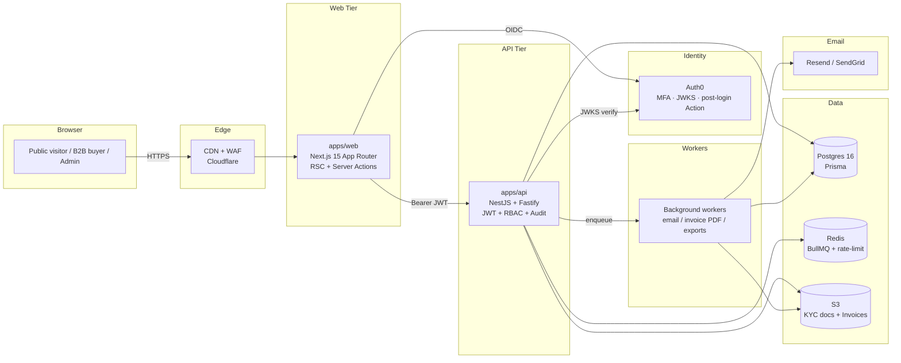

# Parshlo — Pharmaceutical B2B Ordering Platform

[](./.github/workflows/ci.yml)
[](./.github/workflows/codeql.yml)
[](#license)


> A secure, enterprise-grade **B2B-only** pharmaceutical procurement platform.
> Verified pharmacies, distributors, chemists, hospitals, stockists, and wholesalers can place wholesale orders against a real-time, GST-compliant ordering engine.
> **Not** a consumer pharmacy — there is no public checkout, no retail sale, and no prescription-based dispensing.

---

## Table of Contents

- [Why this repo exists](#why-this-repo-exists)
- [Architecture](#architecture)
- [Tech stack](#tech-stack)
- [Project layout](#project-layout)
- [Getting started](#getting-started)
- [Core data model](#core-data-model)
- [Security model](#security-model)
- [Scripts cheat sheet](#scripts-cheat-sheet)
- [Roadmap](#roadmap)
- [Docs index](#docs-index)
- [License](#license)

---

## Why this repo exists

Parshlo is a vertically integrated pharmaceutical manufacturer. This monorepo is the digital procurement layer that replaces email-and-spreadsheet ordering with an audit-trailed, GST-compliant, MFA-protected portal for verified B2B partners.

**Strictly B2B.** Public users can view the catalog, certifications, and contact info — but only KYC-verified businesses (GSTIN + drug license + pharmacy registration) approved by our compliance team can see pricing, place orders, or download invoices.

---

## Architecture



The full architecture decisions are recorded as ADRs under [`docs/adr/`](./docs/adr/).

---

## Tech stack

| Layer         | Choice                                                                                                               | Why                                                               |
| ------------- | -------------------------------------------------------------------------------------------------------------------- | ----------------------------------------------------------------- |
| Monorepo      | **Turborepo + pnpm workspaces**                                                                                      | Fast, cached, content-aware task graph; industry standard.        |
| Frontend      | **Next.js 15** App Router, **TypeScript** strict, **Tailwind**, **shadcn/ui**, **Framer Motion**, **TanStack Query** | RSC for fast public pages; familiar to FAANG-tier hiring teams.   |
| Backend       | **NestJS 10** on **Fastify**, **Zod** validation, **Pino** logs                                                      | Opinionated, modular, DI-friendly; testable; production hardened. |
| DB            | **PostgreSQL 16** + **Prisma 5**                                                                                     | Type-safe ORM, painless migrations, transactional integrity.      |
| Cache / queue | **Redis 7** + **BullMQ**                                                                                             | Sessions, rate limits, async jobs (emails, invoices).             |
| Auth          | **Auth0** with MFA, JWKS-validated RS256 JWTs                                                                        | Enterprise SSO/MFA without rolling our own auth.                  |
| Storage       | **S3** (LocalStack in dev)                                                                                           | Encrypted-at-rest KYC documents + invoices.                       |
| Email         | **Resend** + React Email templates                                                                                   | Modern, reliable transactional email.                             |
| Observability | **Pino** + **OpenTelemetry** hooks + **Sentry**                                                                      | Structured logs, distributed traces, error monitoring.            |
| Testing       | **Vitest**, **Jest**, **Supertest**, **Playwright**, **Testcontainers**                                              | Unit, integration, contract, E2E coverage.                        |
| Quality       | ESLint flat config, Prettier, Husky + lint-staged, commitlint                                                        | Conventional Commits enforced.                                    |
| CI/CD         | **GitHub Actions** (lint, typecheck, test, build, CodeQL, npm audit)                                                 | Fast feedback, security scanning baked in.                        |
| Containers    | Docker multi-stage (non-root), `docker-compose` for local                                                            | Reproducible local + prod parity.                                 |

---

## Project layout

```
parshlo/
├── apps/
│   ├── api/                  # NestJS + Fastify backend (REST /v1)
│   ├── web/                  # Next.js 15 site + B2B + admin portals
│   │                         #   · /admin/analytics/gross sales + product/region analytics
│   │                         #   · /admin/orders/[id] order inspection
│   │                         #   · /api/admin/orders/[id] pre-approval order edit + CSV export
│   │                         #   · /admin/buyers/[id] buyer analytics
│   │                         #   · /admin/finance/logistics reconciliation
│   └── worker/               # BullMQ background processor
│                             #   · transactional email
│                             #   · invoice PDF generation
│                             #   · KYC decision notifications
├── packages/
│   ├── config/               # Shared ESLint, tsconfig, Tailwind preset
│   ├── db/                   # Prisma schema + migrations + client + seed personas/catalog
│   ├── logger/               # Pino structured logger (PII redaction)
│   ├── queue/                # Typed BullMQ producers + payload contracts
│   ├── telemetry/            # OTel + Sentry + Prometheus init
│   └── types/                # Zod schemas (single source of truth)
├── infra/
│   ├── docker/               # Dockerfiles + LocalStack init
│   └── terraform/            # AWS IaC: VPC, RDS, ElastiCache, S3, ECS, ALB
│       ├── bootstrap/        # State backend (S3 + DynamoDB locks)
│       ├── modules/          # network, data, ecs, edge
│       └── environments/     # dev / staging / prod
├── load/                     # k6 load test scripts (10k VU ramp)
├── docs/
│   ├── adr/                  # Architecture Decision Records (5+)
│   ├── runbooks/             # Incident response
│   ├── architecture.md
│   ├── security.md           # Security model + STRIDE threat model
│   ├── deploy.md             # Production deploy guide
│   ├── demo-script.md        # End-to-end walkthrough for Looms
│   └── release-process.md
├── .github/                  # CI workflows, PR & issue templates
├── docker-compose.yml
├── turbo.json
├── pnpm-workspace.yaml
└── Makefile
```

---

## Getting started

### Prerequisites

- **Node.js 22.x** (`.nvmrc` provided)
- **pnpm 9** (managed via `packageManager` in `package.json`)
- **Docker** (for local Postgres / Redis / MailHog / LocalStack)

### 1. Install

```bash
nvm use            # picks up .nvmrc
corepack enable    # turns on pnpm via Node
pnpm install
```

### 2. Bring up infra

```bash
make up            # postgres + redis + mailhog + localstack
cp .env.example .env
cp apps/web/.env.example apps/web/.env.local
```

### 3. Migrate + seed the database

```bash
make db-migrate
make db-seed
```

### 4. Run the app

```bash
make dev           # api on :4000, web on :3000, worker in same task graph
```

Open:

- Web — http://localhost:3000
- API Swagger — http://localhost:4000/docs
- API metrics — http://localhost:4000/metrics
- MailHog — http://localhost:8025
- LocalStack S3 — http://localhost:4566

### 5. Sign in (dev mode)

The dev auth flow signs HS256 JWTs locally; **no Auth0 tenant is required**.
On the sign-in page choose:

- **Continue as Demo Buyer** — a seeded, KYC-approved buyer (Apex Pharmacy)
  with a real business profile, GSTIN, and drug license. Buyer dashboard,
  catalog with prices, cart, and order placement all work end-to-end.
- **Continue as Demo Admin** — analytics, KYC queue, orders, buyers.
- **Continue as Demo Manager** — staff order placement without admin-only
  approval, status-transition, logistics, or shipment controls.

Set `AUTH_MODE=auth0` plus the Auth0 vars to switch to a real tenant.

---

## Core data model

The Prisma schema (`packages/db/prisma/schema.prisma`) encodes the entire business domain. Key entities:

- **User**, **BusinessProfile** — accounts + KYC details (GSTIN unique, account lifecycle: `PENDING_VERIFICATION → UNDER_REVIEW → APPROVED|REJECTED|SUSPENDED`).
- **KycApplication**, **KycDocument** — review workflow with reviewer + reason.
- **Product**, **ProductCategory**, **Inventory**, **ProductBatch** — formulations, MOQ, display GST rate, MRP, Rate A/PTS, Rate B/PTR, schedule drug class, stock tracking.
- **Order**, **OrderItem**, **OrderStatusEvent**, **Invoice** — full procurement lifecycle (`RECEIVED → UNDER_REVIEW → APPROVED → PREPARING → DISPATCHED`, with `CANCELLED` / `REJECTED` terminals). Manager-created orders require admin or super admin approval, and only admin/super admin roles can transition status, enter shipment tracking, or manage logistics statements.
- **AuditLog** — immutable trail for every mutating action.
- **IdempotencyKey** — duplicate-order protection on retries.
- **ContactInquiry** — public contact form submissions.

> Money is stored as **`BigInt` paise** to avoid floating-point drift on tax calculations.

See [`docs/architecture.md`](./docs/architecture.md) for the full ERD walkthrough.

---

## Security model

Highlights — see [`docs/security.md`](./docs/security.md) for the full STRIDE-style threat model.

- **AuthN**: Auth0 (RS256, JWKS-validated, MFA, anomaly detection).
- **AuthZ**: NestJS `JwtAuthGuard` + `RolesGuard` + `@RequireRoles(...)` decorator + permission set derived from roles in `@parshlo/types`.
- **Validation**: Zod schemas (shared between web and api). Strict whitelisting; no implicit casts.
- **Transport**: HSTS, CSP, frame-ancestors deny, X-Content-Type-Options, Referrer-Policy, Permissions-Policy.
- **Rate limiting**: Multi-tier throttling (short/medium/long), Redis-backed in prod. Contact form aggressively limited.
- **Audit**: `@Audit({...})` decorator + global interceptor writes every state-changing call.
- **Secrets**: All env vars validated at boot via Zod; missing config fails fast in CI/production.
- **PII**: Pino redaction strips GSTIN, PAN, license numbers, mobile, tokens from logs.
- **Idempotency**: Orders require an `Idempotency-Key`; replays return the prior result.
- **Storage**: KYC docs and invoices uploaded to S3 via presigned URLs only; SSE-S3 / SSE-KMS in production.
- **DB**: Parameterized queries via Prisma; `Serializable` transactions for order placement.

---

## Scripts cheat sheet

```bash
pnpm dev                  # everything in parallel (turbo)
pnpm lint                 # ESLint everywhere (zero warnings)
pnpm typecheck            # tsc --noEmit everywhere
pnpm test                 # unit + integration
pnpm --filter @parshlo/web test:e2e   # Playwright
pnpm build                # turbo build, content-hashed cache
pnpm db:migrate           # Prisma migrate deploy
pnpm db:seed              # dev data
pnpm db:studio            # GUI
pnpm format               # Prettier write
make help                 # full menu
```

---

## What's shipped (end-to-end working)

- [x] Public site: landing, products list + detail, about, certifications, contact (real Zod-validated form POST to API).
- [x] Auth: dev-mode HS256 IdP **+** real Auth0 path via `AUTH_MODE` switch; httpOnly session cookie; Next.js middleware protects `/dashboard/*` and `/admin/*`.
- [x] Buyer flow: catalog with wholesale pricing, persistent zustand cart, MOQ-aware quantity controls, place-order via idempotency key, order detail with state-machine progress.
- [x] Admin flow: analytics overview, KYC queue with approve/reject, all orders, buyers list, products inventory view.
- [x] API: NestJS on Fastify, `/v1` versioning, RFC 7807 problem details, audit interceptor, Zod-derived Swagger, Prometheus `/metrics`, RBAC, Serializable order transactions, presigned S3 URLs.
- [x] Worker: BullMQ workers for email (Mailhog dev / Resend prod), invoice PDF (pdf-lib + SHA-256 + S3), KYC notifications.
- [x] Observability: OpenTelemetry hooks, Sentry, Prometheus histograms + counters (`parshlo_orders_placed_total`, etc.).
- [x] Tests: 30+ Vitest tests on shared schemas + cart math, Jest + Supertest tests on order state machine + dev-jwt verifier, Playwright E2E for the buyer happy path.
- [x] Load: k6 scripts for catalog reads (ramps to 10k VUs) + authenticated order placement (SLOs encoded as thresholds).
- [x] IaC: Terraform skeleton for AWS — VPC, RDS Multi-AZ, ElastiCache, S3 (versioned, SSE, 8-yr GST retention), ECS Fargate, ALB, remote state on S3+DynamoDB.
- [x] CI/CD: GitHub Actions lint/typecheck/test/build/CodeQL/commitlint; Conventional Commits enforced.

---

## Docs index

| Doc                                                                          | Purpose                                                 |
| ---------------------------------------------------------------------------- | ------------------------------------------------------- |
| [`docs/architecture.md`](./docs/architecture.md)                             | System overview, request flow, data model walkthrough   |
| [`docs/security.md`](./docs/security.md)                                     | Security controls + STRIDE threat model                 |
| [`docs/deploy.md`](./docs/deploy.md)                                         | Production deploy guide (Docker + Terraform + ECS)      |
| [`docs/demo-script.md`](./docs/demo-script.md)                               | 5-minute walkthrough script (great for Loom recordings) |
| [`docs/release-process.md`](./docs/release-process.md)                       | Branching, tagging, hotfixes, rollback                  |
| [`docs/adr/0001-monorepo.md`](./docs/adr/0001-monorepo.md)                   | Why pnpm + Turborepo                                    |
| [`docs/adr/0002-nestjs-on-fastify.md`](./docs/adr/0002-nestjs-on-fastify.md) | Why NestJS + Fastify                                    |
| [`docs/adr/0003-prisma-postgres.md`](./docs/adr/0003-prisma-postgres.md)     | Why Prisma + Postgres                                   |
| [`docs/adr/0004-auth0.md`](./docs/adr/0004-auth0.md)                         | Why Auth0 over rolling our own                          |
| [`docs/adr/0005-zod-shared-types.md`](./docs/adr/0005-zod-shared-types.md)   | Why Zod as the contract source                          |
| [`docs/runbooks/incident-response.md`](./docs/runbooks/incident-response.md) | On-call response template                               |
| [`CONTRIBUTING.md`](./CONTRIBUTING.md)                                       | Branch + commit + PR conventions                        |
| [`SECURITY.md`](./SECURITY.md)                                               | Responsible disclosure                                  |

---

## License

Proprietary — all rights reserved. This repository is published as a portfolio/reference work. Reach out before using it commercially.
