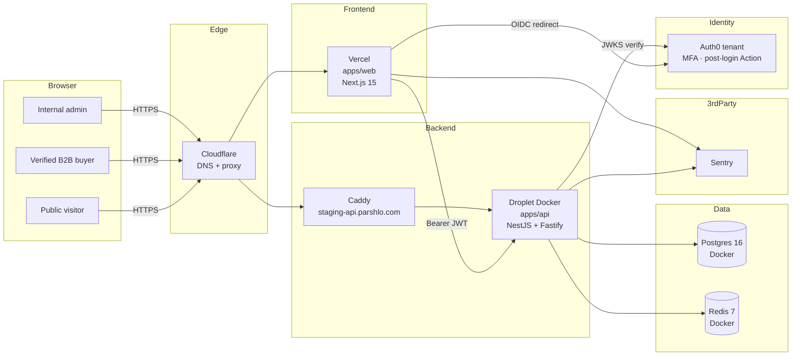
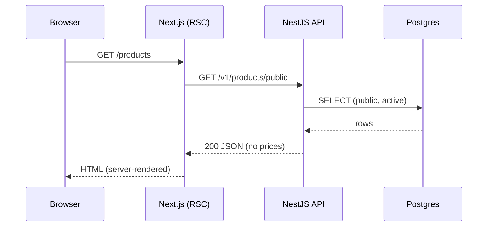
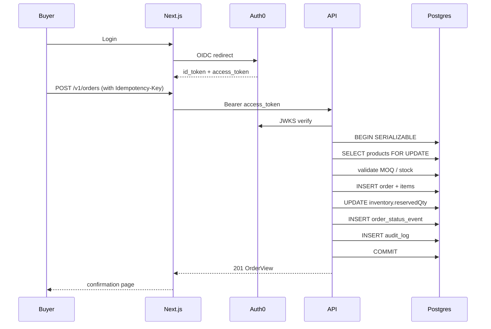
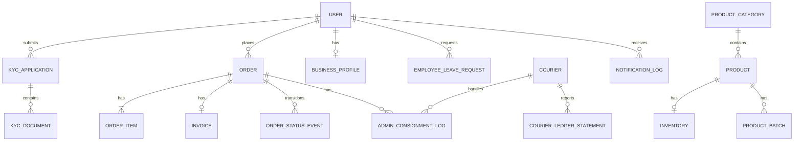

# Architecture

This document walks through how Parshlo is put together today: the request flow, the data model, and the trust boundaries.

Current staging runs the web app on Vercel and the API on a DigitalOcean droplet behind Caddy. The worker, email sender, document storage, and Terraform AWS stack are present as foundations/plans, but they are not required for the current staging website.

## 1. High-level diagram

## 2. Request lifecycle

### 2.1 Public catalog read

### 2.2 Verified buyer placing an order

## 3. Trust boundaries

| Boundary         | Trust direction          | Controls                                                         |
| ---------------- | ------------------------ | ---------------------------------------------------------------- |
| Browser → Web    | untrusted → semi-trusted | HTTPS, HSTS, CSP, XSS-safe RSC, CSRF-aware server routes         |
| Web → API        | semi-trusted → trusted   | Bearer JWT from Auth0, CORS allowlist, no credentials forwarding |
| API → DB         | trusted → trusted        | Connection pool, parameterized queries via Prisma                |
| API → Redis      | trusted → trusted        | Private Docker network in staging; private network in prod       |
| API → Auth0      | trusted → trusted        | JWKS over HTTPS, cached + rate-limited                           |
| API/Web → Sentry | trusted → SaaS           | DSNs only, environment tags, no secrets in event payloads        |

## 4. Data model summary

See the Prisma schema at `packages/db/prisma/schema.prisma`. Cardinality cheat sheet:

Key invariants:

- `BusinessProfile.gstin` is **globally unique**.
- An order is uniquely identified by `(buyerId, idempotencyKey)`.
- `OrderItem.productNameSnapshot` is immutable after creation so historical invoices remain accurate even if the product name changes.
- Approved order items keep their historical price snapshots; pre-approval order edits can recalculate current pricing.
- Employee leave requests count pending and approved days against the 30-day yearly allowance.
- Money is stored as `BigInt` paise; never as floats.

## 5. Where to add things

- **A new entity** → `packages/db/prisma/schema.prisma` + migration + `@parshlo/types` schema.
- **A new endpoint** → new module in `apps/api/src/modules/<domain>/` with controller + service.
- **A shared UI primitive** → `apps/web/src/components/ui/` (until split into a `packages/ui`).
- **A reusable Zod schema** → `packages/types/src/<domain>.ts`.
- **A notification event** → write a `NotificationLog` row now; connect email/browser delivery later.
- **A background job** → add a typed queue contract in `packages/queue` and a worker handler once the worker is deployed.
