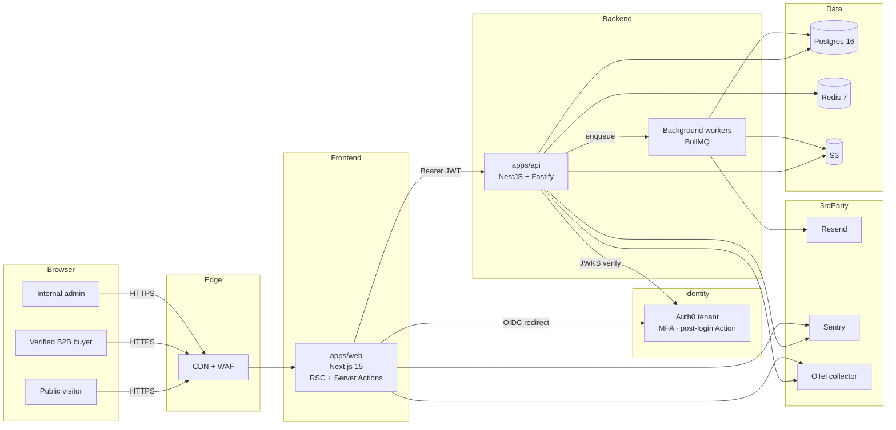
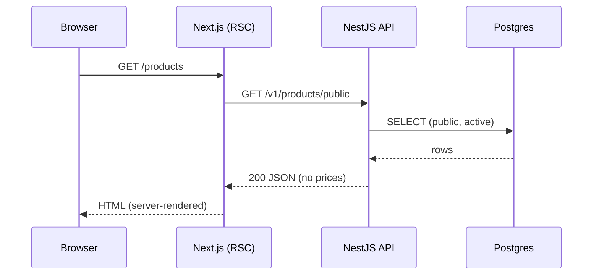
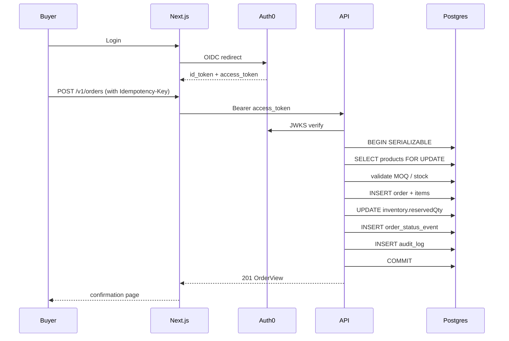
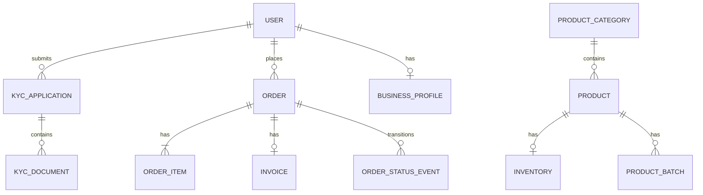

# Architecture

This document walks through how Parshlo is put together: the request flow, the data model, and the trust boundaries.

## 1. High-level diagram

## 2. Request lifecycle

### 2.1 Public catalog read

### 2.2 Verified buyer placing an order

## 3. Trust boundaries

| Boundary | Trust direction | Controls |
| --- | --- | --- |
| Browser → Web | untrusted → semi-trusted | HTTPS, HSTS, CSP, XSS-safe RSC, CSRF tokens on Server Actions |
| Web → API | semi-trusted → trusted | Bearer JWT from Auth0, CORS allowlist, no credentials forwarding |
| API → DB | trusted → trusted | Connection pool, parameterized queries via Prisma, least-privileged role |
| API → S3 | trusted → trusted | IAM role, presigned URLs only, SSE-KMS encryption, bucket policy denying public ACLs |
| API → Auth0 | trusted → trusted | JWKS over HTTPS, cached + rate-limited |

## 4. Data model summary

See the Prisma schema at `packages/db/prisma/schema.prisma`. Cardinality cheat sheet:

Key invariants:
- `BusinessProfile.gstin` is **globally unique**.
- An order is uniquely identified by `(buyerId, idempotencyKey)`.
- `OrderItem.productNameSnapshot` is immutable after creation so historical invoices remain accurate even if the product name changes.
- Money is stored as `BigInt` paise; never as floats.

## 5. Where to add things

- **A new entity** → `packages/db/prisma/schema.prisma` + migration + `@parshlo/types` schema.
- **A new endpoint** → new module in `apps/api/src/modules/<domain>/` with controller + service.
- **A shared UI primitive** → `apps/web/src/components/ui/` (until split into a `packages/ui`).
- **A reusable Zod schema** → `packages/types/src/<domain>.ts`.
- **A background job** → new BullMQ queue under `apps/api/src/modules/queues/` (planned).
